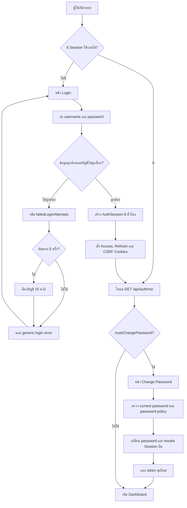
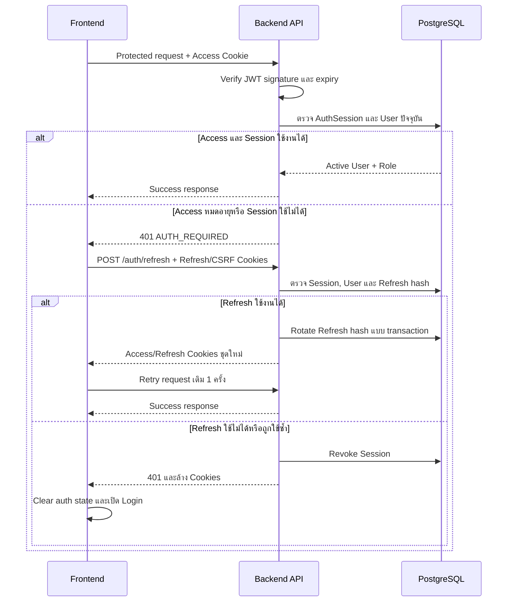
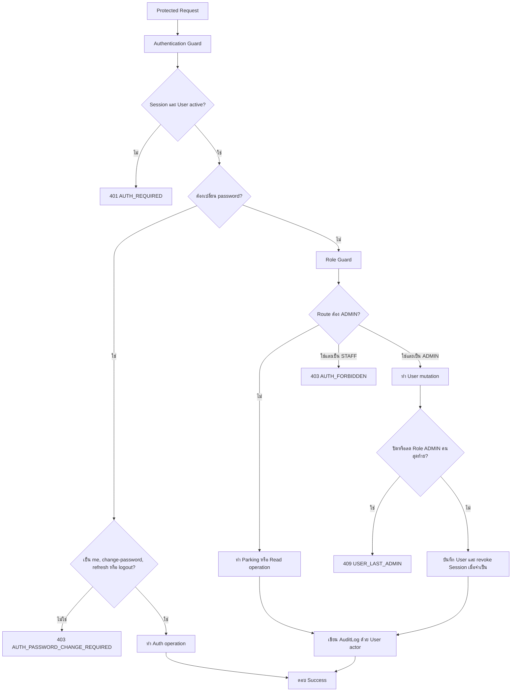

# Authentication และ Authorization Design

วันที่: 27 กรกฎาคม 2569

## เป้าหมาย

เพิ่มระบบยืนยันตัวตนและกำหนดสิทธิ์ให้ SPK R5 Parking Log โดยรองรับผู้ใช้ภายใน 2 บทบาท:

- `ADMIN`: ใช้งาน Parking API และจัดการผู้ใช้
- `STAFF`: ดูข้อมูลบ้าน เพิ่ม/ยกเลิก Violation และ Mark Paid

ระบบใช้ `username + password`, Access Token และ Refresh Token บน HttpOnly Cookie ผู้ใช้ใหม่ต้องเปลี่ยนรหัสผ่านก่อนใช้งานส่วนอื่น

## ขอบเขต

รวม:

- Login, Refresh, Logout และ Current User
- เปลี่ยนรหัสผ่านตัวเอง
- ADMIN สร้าง แก้ไข ปิดใช้งาน และ Reset Password ผู้ใช้
- Backend Guards สำหรับ Authentication, Role และ Must-change-password
- Frontend Auth Gate, Login, Change Password และ User Management
- ปิด Search Engine indexing สำหรับ Admin UI ด้วย `noindex`
- เชื่อมผู้ใช้จริงเข้ากับ Parking AuditLog
- Seed ADMIN คนแรกจาก Environment Variables
- Tests ระดับ Unit, Integration, E2E และ Browser

ไม่รวม:

- สมัครบัญชีเอง
- Email verification หรือ Forgot Password ผ่าน Email
- Multi-factor Authentication
- Social Login หรือ OAuth
- Online Payment
- ลบผู้ใช้ถาวร
- Session Management UI สำหรับดูอุปกรณ์ทั้งหมด

## การตัดสินใจหลัก

- Roles: `ADMIN`, `STAFF`
- Login identifier: `username`
- Session สูงสุด: 8 ชั่วโมง
- Access Token: JWT อายุ 15 นาที
- Refresh Token: opaque random token อายุ 8 ชั่วโมง
- ผู้ใช้ใหม่และผู้ใช้ที่ถูก Reset Password ต้องเปลี่ยนรหัสผ่าน
- Login ผิด 5 ครั้งล็อกบัญชี 15 นาที
- Password อย่างน้อย 12 ตัว มีตัวพิมพ์ใหญ่ ตัวพิมพ์เล็ก และตัวเลข
- ADMIN จัดการผู้ใช้ผ่าน Frontend
- ADMIN คนแรกสร้างด้วย Seed จาก Environment Variables

## Flow Diagram

### Login และบังคับเปลี่ยนรหัสผ่าน



### Protected Request และ Token Refresh



### Authorization และ User Management



## สถาปัตยกรรม Token และ Session

### Access Token

Access Token เป็น JWT ที่ Backend ลงลายเซ็น อายุ 15 นาที และเก็บใน Cookie:

- ชื่อ: `spk_r5_access`
- `HttpOnly`
- `SameSite=Lax`
- `Secure=true` ใน Production
- `Path=/api`

Claims ขั้นต่ำ:

- `sub`: User UUID
- `sid`: AuthSession UUID
- `role`: Role ตอนออก Token
- `mustChangePassword`
- `iat`
- `exp`

Guard ไม่เชื่อ Role หรือสถานะใน JWT เพียงอย่างเดียว ทุก protected request ต้องตรวจ `AuthSession` และ `User` ปัจจุบันจาก PostgreSQL เพื่อให้การ Logout, ปิดบัญชี, เปลี่ยน Role และเปลี่ยนรหัสผ่านมีผลทันที

### Refresh Token

Refresh Token เป็น opaque token รูปแบบ `sessionId.secret`:

- `sessionId`: AuthSession UUID
- `secret`: random bytes ที่มี entropy อย่างน้อย 256 bits
- เก็บใน Cookie `spk_r5_refresh`
- `HttpOnly`
- `SameSite=Lax`
- `Secure=true` ใน Production
- `Path=/api/auth`

Database เก็บเฉพาะ hash ของ `secret` โดยใช้ server-side pepper ไม่เก็บ token จริง

เมื่อ Refresh สำเร็จ:

1. ตรวจ Session, User, expiry และ token hash
2. หมุน Refresh Token
3. แทนที่ hash เดิมแบบ transaction
4. ออก Access Token ใหม่
5. อัปเดต `lastUsedAt`

ถ้าใช้ Refresh Token เก่าซ้ำกับ Session ที่ยังระบุได้ ระบบ revoke Session นั้นและล้าง Cookies

### Session Lifetime

- AuthSession หมดอายุแบบ absolute หลัง Login 8 ชั่วโมง
- Refresh ไม่ขยาย `expiresAt`
- Access Token ต้องไม่หมดอายุช้ากว่า Session
- Session ที่หมดอายุหรือถูก revoke ใช้ไม่ได้
- Cleanup ทำแบบ lazy ระหว่าง Auth flow และมี maintenance command สำหรับลบ Session เก่า

### Logout และ Global Revoke

- Logout revoke Session ปัจจุบันและล้าง Access/Refresh/CSRF Cookies
- เปลี่ยนรหัสผ่าน revoke Session ทั้งหมดของ User ยกเว้น Session ปัจจุบัน จากนั้นออก token ชุดใหม่ให้ Session ปัจจุบัน
- ADMIN Reset Password หรือปิด User ต้อง revoke Session ทั้งหมดทันที

## CSRF, CORS และ Cookie Security

Frontend และ Backend สื่อสารด้วย Cookies ผ่าน Axios `withCredentials: true`

Production ต้องให้ Frontend และ Backend อยู่ hostname เดียวกัน โดย Backend ใช้ path `/api` เพื่อให้ Frontend อ่าน CSRF cookie ได้โดยไม่ขยาย Cookie Domain ข้าม subdomain ส่วน Development ใช้ `localhost` คนละ port ได้เพราะ Cookie ไม่แยกตาม port

มาตรการ CSRF:

- Backend ตรวจ `Origin` ให้ตรงกับ `FRONTEND_URL` สำหรับ state-changing requests
- ใช้ double-submit token:
  - Cookie `spk_r5_csrf` อ่านได้โดย Frontend, `SameSite=Lax`, `Path=/` และ `Secure=true` ใน Production
  - Frontend ส่งค่าเดียวกันใน `X-CSRF-Token`
  - Backend เปรียบเทียบแบบ constant-time
- Login ตรวจ Origin และสร้าง CSRF Cookie หลังสำเร็จ
- Refresh, Logout, Change Password, User mutations และ Parking mutations ต้องผ่าน CSRF validation

CORS:

- อนุญาต origin เดียวจาก `FRONTEND_URL`
- เปิด credentials
- ไม่ใช้ wildcard origin

Production Cookies ต้องมี `Secure` และ Backend ต้องปฏิเสธ `COOKIE_SECURE=false` ใน Production; Development บน `http://localhost` ใช้ `COOKIE_SECURE=false`

## Data Model

### UserRole

```text
ADMIN
STAFF
```

### User

| Field               | Type                 | กติกา                   |
| ------------------- | -------------------- | ----------------------- |
| id                  | UUID                 | Primary key             |
| username            | VarChar(64)          | unique, lowercase, trim |
| displayName         | VarChar(255)         | required                |
| passwordHash        | VarChar(255)         | Argon2id                |
| role                | UserRole             | ADMIN หรือ STAFF        |
| isActive            | Boolean              | default true            |
| mustChangePassword  | Boolean              | default true            |
| failedLoginAttempts | Int                  | default 0               |
| lockedUntil         | Timestamptz nullable | ล็อกชั่วคราว            |
| passwordChangedAt   | Timestamptz          | เวลาตั้งรหัสผ่านล่าสุด  |
| createdAt           | Timestamptz          | audit timestamp         |
| updatedAt           | Timestamptz          | audit timestamp         |

Relations:

- `sessions`: AuthSession[]

ห้ามลบ User ผ่าน Application API

### AuthSession

| Field            | Type                  | กติกา                  |
| ---------------- | --------------------- | ---------------------- |
| id               | UUID                  | Primary key            |
| userId           | UUID                  | relation ไป User       |
| refreshTokenHash | VarChar(255)          | hash + pepper          |
| expiresAt        | Timestamptz           | absolute expiry        |
| revokedAt        | Timestamptz nullable  | revoke marker          |
| lastUsedAt       | Timestamptz           | refresh/login activity |
| ipAddress        | VarChar(64) nullable  | metadata แบบจำกัด      |
| userAgent        | VarChar(512) nullable | truncate ก่อนเก็บ      |
| createdAt        | Timestamptz           | audit timestamp        |
| updatedAt        | Timestamptz           | audit timestamp        |

Indexes:

- `userId`
- `expiresAt`
- `revokedAt`

### AuditLog

Parking mutations ต้องรับ `AuthenticatedActor` จาก Controller และเขียน:

- `actorType=USER`
- `actorId=user.id`
- `actorLabel=user.displayName`

เพิ่ม AuditAction สำหรับ Auth/User lifecycle:

- `LOGIN`
- `LOGOUT`
- `CHANGE_PASSWORD`
- `CREATE_USER`
- `UPDATE_USER`
- `RESET_PASSWORD`
- `ACTIVATE`
- `DEACTIVATE`

Audit ห้ามเก็บ password, passwordHash, Access Token, Refresh Token หรือ CSRF token

## Password และ Login Policy

### Password

Password ต้อง:

- ยาวอย่างน้อย 12 ตัว
- มีตัวพิมพ์ใหญ่อย่างน้อย 1 ตัว
- มีตัวพิมพ์เล็กอย่างน้อย 1 ตัว
- มีตัวเลขอย่างน้อย 1 ตัว
- ไม่ยาวเกิน 128 ตัว

Hash ด้วย Argon2id โดยใช้ค่าจากไลบรารีที่ผ่านการดูแลและ parameter ที่เหมาะกับ production ห้ามใช้ SHA, MD5 หรือ reversible encryption

### Login Failure

- Username normalize เป็น lowercase และ trim ก่อนค้นหา
- Password หรือ Username ผิดตอบข้อความกลางเดียวกัน
- เพิ่ม `failedLoginAttempts` เฉพาะ User ที่พบ
- ครั้งที่ 5 ตั้ง `lockedUntil = now + 15 minutes`
- เมื่อพ้นเวลา lock ให้เริ่มนับใหม่
- Login สำเร็จ reset counter และ `lockedUntil`
- Endpoint Login และ Refresh มี IP rate limit เพิ่มจาก account lockout
- Response ห้ามเปิดเผยว่า Username มีจริงหรือบัญชีถูกปิด

## Authorization Rules

### Public Surface

- `GET /api/health`
- `POST /api/auth/login`
- `POST /api/auth/refresh` ไม่ต้องมี Access Token แต่ต้องมี valid Refresh Cookie และ CSRF/Origin

### Authenticated Surface

- `POST /api/auth/logout`
- `GET /api/auth/me`
- `POST /api/auth/change-password`
- `GET /api/houses`
- `GET /api/houses/:houseCode`

### STAFF และ ADMIN

- `POST /api/houses/:houseCode/violations`
- `POST /api/houses/:houseCode/violations/:violationId/cancel`
- `POST /api/houses/:houseCode/violations/:violationId/mark-paid`

### ADMIN เท่านั้น

- `GET /api/users`
- `POST /api/users`
- `PATCH /api/users/:userId`
- `POST /api/users/:userId/reset-password`

### Must-change-password

เมื่อ `mustChangePassword=true` อนุญาตเฉพาะ:

- `GET /api/auth/me`
- `POST /api/auth/change-password`
- `POST /api/auth/refresh`
- `POST /api/auth/logout`

Endpoint อื่นตอบ `403 AUTH_PASSWORD_CHANGE_REQUIRED`

### ADMIN Safety

- ห้าม ADMIN ปิดบัญชีตัวเอง
- ห้ามลด Role หรือปิดใช้งาน ADMIN คนสุดท้าย
- ตรวจและแก้ไขภายใน Serializable Transaction ป้องกัน race condition
- ADMIN เปลี่ยนรหัสผ่านตัวเองผ่าน Change Password ไม่ใช่ Reset Password

## API Contract

### Auth

```text
POST /api/auth/login
Body: { username, password }
Response: { user }

POST /api/auth/refresh
Body: {}
Response: { user }

POST /api/auth/logout
Body: {}
Response: { success: true }

GET /api/auth/me
Response: { user }

POST /api/auth/change-password
Body: { currentPassword, newPassword, confirmPassword }
Response: { user }
```

`user`:

```text
{
  id,
  username,
  displayName,
  role,
  isActive,
  mustChangePassword
}
```

### User Management

```text
GET /api/users
Response: { users: UserSummary[] }

POST /api/users
Body: { username, displayName, role, temporaryPassword }
Response: { user }

PATCH /api/users/:userId
Body: { displayName?, role?, isActive? }
Response: { user }

POST /api/users/:userId/reset-password
Body: { temporaryPassword }
Response: { user }
```

Create และ Reset Password ตั้ง `mustChangePassword=true` เสมอ ADMIN เป็นผู้กำหนด temporary password ตาม policy ระบบไม่ส่ง password กลับใน response

### Error Codes

| HTTP | Code                          | ความหมาย                    |
| ---- | ----------------------------- | --------------------------- |
| 401  | AUTH_INVALID_CREDENTIALS      | Login ไม่สำเร็จ             |
| 401  | AUTH_REQUIRED                 | ไม่มีหรือ Session ใช้ไม่ได้ |
| 403  | AUTH_FORBIDDEN                | Role ไม่พอ                  |
| 403  | AUTH_PASSWORD_CHANGE_REQUIRED | ต้องเปลี่ยนรหัสผ่าน         |
| 403  | CSRF_INVALID                  | CSRF/Origin ไม่ผ่าน         |
| 409  | USERNAME_TAKEN                | Username ซ้ำ                |
| 409  | USER_LAST_ADMIN               | ขัดกฎ ADMIN คนสุดท้าย       |
| 429  | AUTH_RATE_LIMITED             | Request มากเกิน             |

ใช้ API error envelope เดิมและไม่ส่ง stack trace

## Frontend Design

### Search Indexing Hardening

- Root metadata ใช้ `robots: { index: false, follow: false, nocache: true }`
- ไม่สร้าง `sitemap.xml` เพราะทุก route เป็น Admin UI
- `noindex` เป็น crawler guidance เท่านั้น ไม่ใช่ security boundary
- Backend Authentication และ Authorization ยังเป็นตัวป้องกันข้อมูลจริง

### Routes

- `/login`: Login form
- `/change-password`: Change Password form
- `/users`: ADMIN User Management
- `/`: Protected Dashboard
- `/houses/R5-001` ถึง `/houses/R5-164`: Protected House Detail

ทุก route ยังคงรองรับ Static Export ไม่มี Next.js Middleware การป้องกันข้อมูลจริงอยู่ที่ Backend Guards

### Auth State

- `AuthProvider` เรียก `GET /auth/me` ก่อนแสดง protected app
- Zustand เก็บเฉพาะ current user และ auth UI state ไม่เก็บ token
- TanStack Query ดูแล `/auth/me` และ User list
- Loading แสดงหน้า auth bootstrap ไม่ flash protected content
- ไม่มี Session ไป `/login`
- `mustChangePassword=true` ไป `/change-password`
- Login แล้วเปิด `/login` ให้ไป Dashboard

### Axios Refresh

- Axios instance ตั้ง `withCredentials: true`
- Request interceptor ใส่ `X-CSRF-Token` สำหรับ mutation
- Response 401 เรียก `/auth/refresh` แล้ว retry request เดิมไม่เกิน 1 ครั้ง
- ใช้ refresh mutex ให้ concurrent 401 ใช้ refresh request เดียว
- ห้าม interceptor refresh `/auth/login`, `/auth/refresh` หรือ request ที่ retry แล้ว
- Refresh ไม่ผ่านให้ clear auth state และไป `/login`

### Navigation และ User Management

- Sidebar/Header แสดง display name, role และ Logout
- ADMIN เห็นเมนู “ผู้ใช้งาน”
- STAFF ไม่เห็นเมนู แต่ Backend ยังตอบ 403 ถ้าเรียก URL/API ตรง
- User table แสดง username, display name, role, status และ must-change-password
- Modal รองรับ Create, Edit, Activate/Deactivate และ Reset Password
- ใช้ React Hook Form, Zod, TanStack Query, Axios, Zustand, date-fns และ Lucide React ตาม frontend stack เดิม

## Seed และ Environment

Environment Variables:

```env
JWT_ACCESS_SECRET=<random อย่างน้อย 32 bytes>
AUTH_TOKEN_PEPPER=<random อย่างน้อย 32 bytes>
ADMIN_USERNAME=admin
ADMIN_PASSWORD=<ตรง Password Policy>
ADMIN_DISPLAY_NAME=ผู้ดูแลระบบ
COOKIE_SECURE=false
FRONTEND_URL=http://localhost:3000
```

กติกา:

- Backend Production ขาดหรือใช้ secret สั้นเกินกำหนดต้อง fail fast
- Seed ขาด ADMIN variables ต้องแจ้ง error ชัดเจน
- Seed ADMIN เป็น idempotent
- ถ้า Username มีแล้ว Seed ไม่แก้ password, role, status หรือ display name
- Seed บ้าน 164 หลังเดิมยังทำงานเหมือนเดิม
- Migration ต้องรักษาข้อมูล House, Cycle, Violation, Fine, Evidence และ AuditLog เดิม

## Testing Strategy

### Backend Unit

- Password policy และ Argon2id hash/verify
- Username normalization
- Login success/failure/disabled/lockout
- Lock 5 ครั้งและปลดหลัง 15 นาที
- JWT claims, signature และ expiry
- Refresh token hash, rotation, reuse และ absolute expiry
- Cookie settings
- Authentication Guard
- Role Guard
- Must-change-password Guard
- CSRF และ Origin validation
- ADMIN คนสุดท้ายและ self-deactivation
- Seed idempotency
- Audit redaction และ actor propagation

### Backend E2E

E2E ต้องรันบน PostgreSQL แยกที่ชื่อฐานข้อมูลลงท้าย `_test` เท่านั้น
runner เตรียม migration และ seed ในฐานทดสอบก่อนเริ่ม และต้อง fail fast
หากถูกสั่งให้ใช้ฐานข้อมูลปกติ

- Protected API ตอบ 401 เมื่อไม่มี Session
- Login ตั้ง Cookies และ `/auth/me` ใช้งานได้
- Access หมดแล้ว Refresh ออก token ใหม่
- Refresh rotation ปฏิเสธ token เก่า
- Logout revoke Session
- Password change revoke Session อื่น
- STAFF ใช้ Parking mutations แต่ใช้ User API ไม่ได้
- ADMIN จัดการผู้ใช้
- ADMIN ใช้ Reset Password กับบัญชีตัวเองไม่ได้
- CSRF invalid ถูกปฏิเสธ
- Parking AuditLog บันทึก User actor

Production ต้องกำหนด `TRUST_PROXY_HOPS` ตามจำนวน reverse proxy ที่รู้แน่นอน
(`0–3`) เพื่อไม่เชื่อถือ `X-Forwarded-For` จาก client โดยตรง

### Frontend

- Login validation และ generic error
- Auth bootstrap และ redirect
- Forced password change
- Axios single-flight refresh และ retry ครั้งเดียว
- Refresh ข้ามแท็บต้องใช้ Web Locks API; browser ที่ไม่รองรับต้อง fail safe
  และกลับไป Login โดยห้าม rotate token แบบไม่มี coordination
- Logout clear state
- Role-based navigation
- User list และ ADMIN mutations
- STAFF ไม่เห็น ADMIN actions
- Accessible modal, focus return และ keyboard flow

### Browser Acceptance

- Desktop 1440×900
- Mobile 390×844
- Login, forced password change, logout
- ADMIN สร้าง STAFF, ปิด/เปิด และ Reset Password
- STAFF ใช้ Parking workflow และเปิด `/users` ไม่ได้
- Session expiry/refresh ไม่ทำข้อมูล form หาย
- ไม่มี raw stack, token หรือ password ใน UI/log

## Success Criteria

- API ทุกตัวนอกจาก Public Surface ป้องกันด้วย Backend Authentication
- ทุกหน้าใช้ `noindex, nofollow`
- Role enforcement อยู่ Backend และมี Frontend affordance ตรงกัน
- Access Token และ Refresh Token ไม่เข้าถึงผ่าน JavaScript และไม่อยู่ localStorage/sessionStorage
- Refresh Token ใน Database เป็น hash เท่านั้นและหมุนทุกครั้ง
- Logout, ปิด User และ Reset Password ตัด Session ตามกติกา
- ผู้ใช้ใหม่เปลี่ยนรหัสผ่านก่อนใช้ Parking API
- AuditLog ระบุ User ที่ทำ Parking mutation
- Tests, lint, typecheck, build และ browser acceptance ผ่าน
